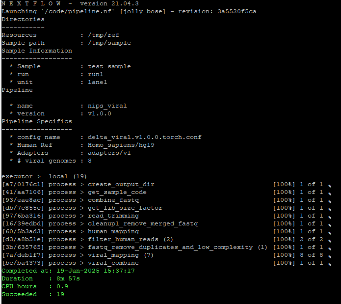
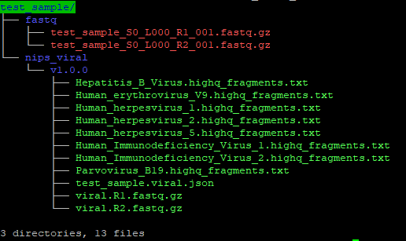

# NIPS viral screen

## How to Cite

Our publication is currently in the review process.

```
Herroelen P.H., Swaerts K. et al, Universal screening of cytomegalovirus viral load by low-pass whole genome sequencing in first trimester pregnancy: clinical validation
```

## Install

All needed resources are included in this repository, since the human reference genome is included, the download can take a while.

```bash
git clone https://github.com/AZ-Delta-Dept-Laboratory-Medicine/NIPS_viral_screen.git
```

Building the docker image

```bash
docker build -t localhost/nips_viral_screen:v1.0.0 -f Dockerfile
```

Extracting the viral resources. You still will have to install the human genome (hg19) and create the bowtie indexes
```bash
tar -xzvf resources.tar.gz
```

You still will have to install the human genome (hg19) and create the bowtie indexes! The fasta file of the reference needs to be called genome.fa
```bash
mkdir resources/Homo_sapiens/hg19
docker run --rm -it -v PATH_TO_THE_RESOURCES/:/tmp/ref:rw,z --entrypoint bash localhost/nips_viral_screen:v1.0.0
```
Inside this container execute:
```bash
conda activate mapping
cd /tmp/ref/Homo_sapiens/hg19
bowtie2-build genome.fa genome
```

## Pipeline

The pipeline starts from fastq.gz PE files. These can be the outcome of the Illumina bcl-converter with as names *SAMPLE*_S\*_L0??_R1_001.fastq.gz or *SAMPLE*.R1.fastq.gz. In the first all files with the pattern *SAMPLE*\*_R1_001.fastq.gz will be merged to *SAMPLE*.R1.fastq.gz (idem for R2).  
  
The input path structure has to be the path to the sample data, with a "fastq" folder containing the fastq.gz files. The pipeline will create a new folder structure with the name nips_viral/v1.0.0, containing all output data.  
  
The PLACEHOLDERS for RUN and UNIT are used in the output json file (for extra information in the parsing to the results). The PLACEHOLDER_SAMPLE is used to find the sample fastq file, and in the result output json file.

```bash
docker run --rm -it -v PATH_TO_THE_INPUT_DATA:/tmp/sample:rw,z -v PATH_TO_THE_RESOURCES/:/tmp/ref:ro,z -v PATH_TO_TMP_WORK_DIR:/tmp/work:rw,z localhost/nips_viral_screen:v1.0.0 --resources /tmp/ref --sample_path /tmp/sample --run PLACEHOLDER_RUN --samplename PLACEHOLDER_SAMPLE --unit PLACEHOLDER_UNIT -work-dir /tmp/work
```



## Resources

All needed resources for the pipeline are included in the resources folder.

## Output of the pipeline

Next to the input fastq folder, an output folder is generated with the name of the pipeline, and the version. Per target, a file with the readnames of high quality matches is generated. The viral.R1.fastq.gz and viral.R2.fastq.gz contain the PE reads after the human removal, duplication (possible artifacts of the sequencing) and low complexity removal. The viral.json file contains all information in a computer structured format, easy to asses and evaluate, but also able to use as input for reporting. An example of the output json file is found in the extra folder.

